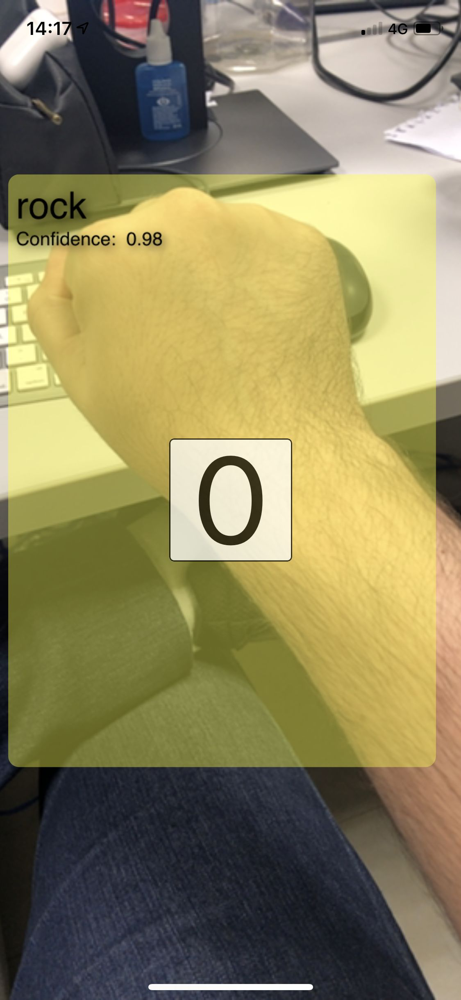
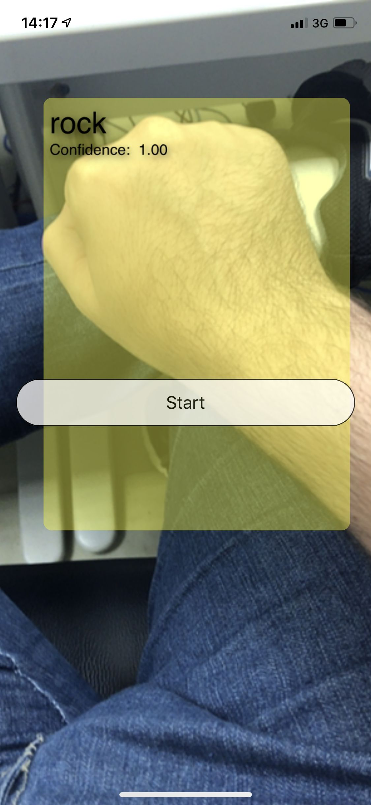
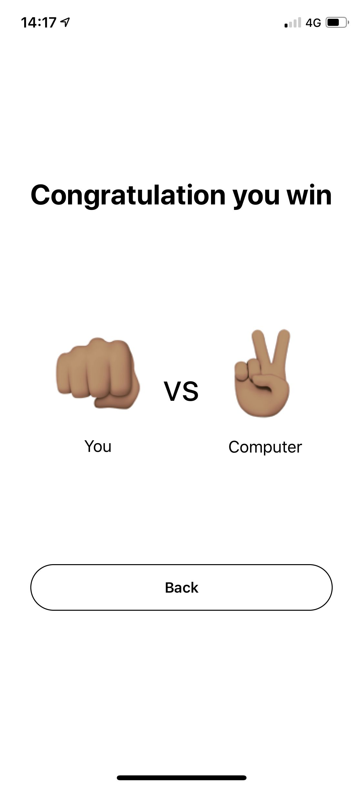

# Rock-Paper-Scissors Game

An iOS app which is the rock-paper-scissors game. It was developed from mlmodel to layout. This is an academic project, so it was not focused on developing with code quality, architecture, design pattern or testability.

    
    
    

### Prerequisites

* [Xcode](https://developer.apple.com/xcode/) 11.3
* A iPhone, because this application does not run in simulator

# Acknowledgments

I used those articles to make this project:
  - [Recognizing objects in live capture](https://developer.apple.com/documentation/vision/recognizing_objects_in_live_capture)
  - [Train and Ship a Core ML Object Detection Model for iOS in 4 Hours — Without a Line of Code](https://heartbeat.fritz.ai/train-and-ship-a-core-ml-object-detection-model-for-ios-in-4-hours-without-a-line-of-code-eb36942c2b21)
